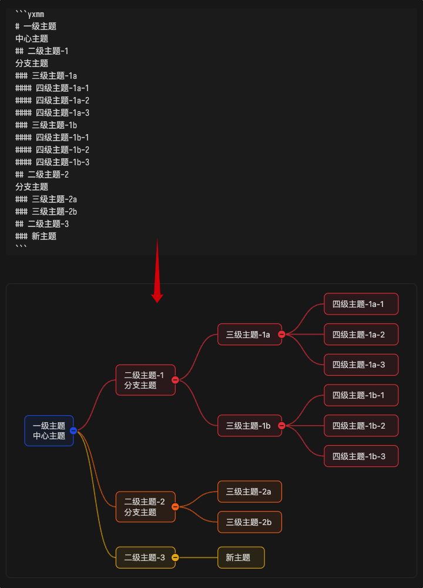
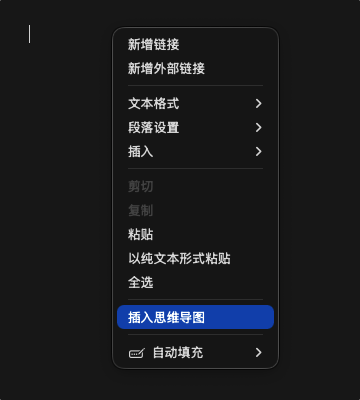

# yonxao-mindmap

[](https://github.com/yonxao/yonxao-mindmap/releases/latest) [](https://community.obsidian.md/plugins/yonxao-mindmap) [](https://github.com/yonxao/yonxao-mindmap/blob/main/manifest.json) [](https://github.com/yonxao/yonxao-mindmap/blob/main/LICENSE) [](https://github.com/yonxao/yonxao-mindmap/blob/main/README.md)

这是一个功能丰富的 Obsidian 思维导图插件，将 Markdown 文档中的 `yxmm` 代码块渲染为可交互的 SVG 思维导图及多种结构图。

[English README](./README.md)

演示截图如下图：



## ✨ 核心特性

- 🎨 **丰富的布局类型**：支持思维导图（右/左/双向/上/下/垂直）、树形图、组织结构图、时间轴、放射图、鱼骨图、树形表格等 7 大类共 20 种布局
- 🎯 **直观的语法**：使用主题级别标记（`#`、`##`、`###`）表达层级，自然流畅
- 🖱️ **完整的交互编辑**：双击编辑、拖拽排序、右键菜单、折叠展开，支持完整的主题树编辑
- 🎨 **8 种主题色系**：default、ocean、forest、sunset、mono、rainbow、pastel-rainbow、neon-rainbow
- 🔗 **灵活的连线线型**：曲线、直线、折线，思维导图布局可自由切换
- 📐 **自定义字体**：支持按主题级别设置字体、字号、字重、行高
- 🖼️ **导出功能**：支持导出 PNG 图片或复制到剪贴板
- 🌐 **多语言支持**：支持 16 种语言，自动跟随 Obsidian 语言设置
- ⚙️ **可视化配置面板**：直观的配置界面，支持全局默认值和代码块级配置
- 📱 **响应式设计**：适配不同屏幕尺寸和 Obsidian 主题

## 🚀 快速上手

### 基础用法

- 在 Markdown 文档中创建 `yxmm` 代码块：

  光标移出代码块后会显示为思维导图。

  ````markdown
  ```yxmm

  ```
  ````

- 右键菜单

  在Obsidian笔记中点击鼠标右键：点击`插入思维导图`。

  

### 完整示例

````markdown
```yxmm
---
structure:
  layout: mindmap-right
  connectorStyle: curve
color:
  scheme: ocean
---

# 中心主题
## 分支主题 A
### 子主题 A1
### 子主题 A2
## 分支主题 B
### 子主题 B1
```
````

## 📝 语法说明

### 主题层级

- 使用主题级别标记表示层级：`#` 是一级主题，`##` 是二级主题，`###` 是三级主题，依此类推。
- 只有 `#`、`##`、`###` 这类主题级别标记行会创建新主题；普通文本行会并入最近的上一个主题，作为多行主题内容。

| 标记  | 含义                          |
| ----- | ----------------------------- |
| `#`   | 一级主题（中心主题 / 根主题） |
| `##`  | 二级主题（分支主题）          |
| `###` | 普通主题（三级及更深）        |

### 多行主题

普通文本行会并入最近的上一个主题，作为多行内容：

````markdown
```yxmm
# 中心主题
## 多行主题示例
这是第二行内容
这是第三行内容
### 子主题
```
````

### 主题内容局部样式

主题内容中可以直接使用轻量标记设置局部文字样式：

````markdown
```yxmm
# 中心主题
## **加粗**、*斜体*、~~中划线~~、++下划线++
## {red|语义色文字} 和 {#3b82f6|Hex 颜色文字}
```
````

支持的局部样式：

- `**文本**`：加粗
- `*文本*`：斜体
- `~~文本~~`：中划线
- `++文本++`：下划线
- `{red|文本}`、`{#3b82f6|文本}`：文字颜色

语义色支持 `red`、`green`、`blue`、`yellow`、`orange`、`purple`、`pink`、`gray`、`black`、`white`。主题编辑面板和长文本编辑浮层提供可视化样式按钮，并支持清除选区或全部内容中的局部样式；这些标记属于主题内容，不是主题属性。

### 主题属性

在主题级别标记行末尾添加 `[key=value]` 格式的属性：

````markdown
```yxmm
# 中心主题 [color=#3b82f6]
## 分支主题 [icon=book layout=mindmap-right]
### 子主题 [fontSize=14 fontWeight=700]
```
````

支持的属性：

- `color=#3b82f6`：主题颜色
- `icon=book`：主题图标
- `layout=mindmap-right`：局部布局类型
- `fontSize=16`、`fontWeight=700`、`fontFamily="..."`、`lineHeight=20`：字体覆盖

### 配置区

在代码块顶部添加 `---` 包裹的 YAML 配置区：

````markdown
```yxmm
---
display:
  viewFit: fit
  fitViewNoUpscale: true
  saveFullConfig: true
structure:
  layout: mindmap-right
  connectorStyle: curve
  topicMaxWidth:
    global: 240
color:
  scheme: rainbow
  buttonColorMode: topic
font:
  family: "var(--font-text)"
  size: 16
  weight: 400
  lineHeight: 20
interaction:
  toolbar:
    corner: top-right
    placement: outside
  topicControlVisibility: toggle-always
  wheelZoom: false
  tabIndent: true
---

# 中心主题
## 分支主题
```
````

## 🎨 布局类型

### 思维导图

- `mindmap-right`：右向思维导图（默认）
- `mindmap-left`：左向思维导图
- `mindmap-bidirectional`：双向思维导图
- `mindmap-up`：上向思维导图
- `mindmap-down`：下向思维导图
- `mindmap-vertical`：垂直双向思维导图

### 树形图

- `tree`：树形图
- `tree-right`：右向树形图
- `tree-left`：左向树形图

### 组织结构图

- `org`：组织结构图
- `org-right`：右向组织结构图

### 时间轴

- `timeline`：时间轴
- `timeline-up`：上侧时间轴
- `timeline-down`：下侧时间轴

### 放射图

- `radial`：放射图

### 鱼骨图

- `fishbone-left`：左向鱼骨图
- `fishbone-right`：右向鱼骨图

### 树形表格

- `tree-table`：树形表格
- `tree-table-stepped`：阶梯树形表格

## 🖱️ 操作指南

### 基本操作

- **双击主题**：快速编辑主题内容
- **点击折叠按钮**：折叠/展开子主题
- **拖动主题**：调整同级主题顺序或移动到其他位置
- **右键主题**：打开上下文菜单（新增、删除、复制、折叠等）

### 工具栏操作

- **适配视图**：自动调整视口，完整显示导图
- **放大/缩小**：调整视图缩放比例
- **重置折叠**：展开所有主题
- **配置面板**：打开可视化配置界面
- **源码/导图切换**：在源码模式和导图模式之间切换
- **导出图片**：导出 PNG 图片或复制到剪贴板

### 视图模式

- **阅读视图**：仅浏览，禁用编辑功能
- **编辑视图**：完整编辑能力，支持主题拖拽、新增、删除等

### 高度调整

- **拖动幕布底部边缘**：手动调整幕布高度
- **双击拖拽条**：恢复自动高度

## ⚙️ 配置说明

### 配置优先级

```
主题属性 > 代码块配置区 > 插件全局默认值配置 > 插件内置默认值
```

### 全局默认值配置

在 Obsidian `设置` → `第三方插件` → `yonxao-mindmap` 中设置全局默认值，所有 `yxmm` 代码块都会继承这些配置。

### 语言支持

偏好设置中还提供语言选项，首次默认语言会跟随 Obsidian 当前语言；如果 Obsidian 语言暂不支持，则回退到 English。当前支持：

- English：兜底语言。
- 中文（简体）。
- 中文（繁體）。
- 日本語。
- 한국어。
- Français。
- Deutsch。
- Español。
- Português (Brasil)。
- Русский。
- Italiano。
- Bahasa Indonesia。
- Türkçe。
- Tiếng Việt。
- ไทย。
- हिन्दी。

### 配置区裁剪

如果 `display.saveFullConfig` 为 false，即配置面板中关闭保存全部配置项，
此时，配置区里的配置项的值如果和全局默认值相同，则此配置项会被裁剪以保持配置区简洁。

## 📦 安装

### 从 Obsidian 插件市场安装

1. 打开 Obsidian 设置
2. 点击 `第三方插件`
3. 点击 `浏览`
4. 搜索 `yonxao-mindmap`
5. 点击 `安装`，然后点击 `启用`

### 手动安装

1. 下载最新版本的 `yonxao-mindmap.zip`
2. 解压到 Obsidian 插件目录（`.obsidian/plugins/`）
3. 在 Obsidian 设置中启用插件

## 📄 许可证

本项目采用 AGPLv3 + 商业授权双许可证：

- AGPLv3：见 [LICENSE](LICENSE)
- 商业授权：见 [COMMERCIAL-LICENSE.md](COMMERCIAL-LICENSE.md)

## 🤝 贡献

欢迎提交 Issue 和 Pull Request！

## 📚 文档

- [开发上下文](docs/DEVELOPMENT_CONTEXT.zh-CN.md)：开发协作备忘录，包含架构、术语、流程和常见问题
- [回归测试清单](docs/REGRESSION_TEST_CHECKLIST.zh-CN.md)：回归测试检查清单
- [示例文档](examples/regression-layout-gallery.zh-CN.md)：各种布局的示例集合

---

⭐ 如果这个插件对你有帮助，请给它一个星标！ [](https://github.com/yonxao/yonxao-mindmap)
